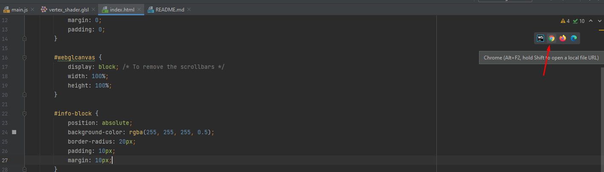

# IMPORTANT!
You need to run `index.html` on a server in order to XMLHttpRequests 
to work with local files (I'm loading shaders and textures via `fetch`).
In WebStorm I was running it via this feature:

